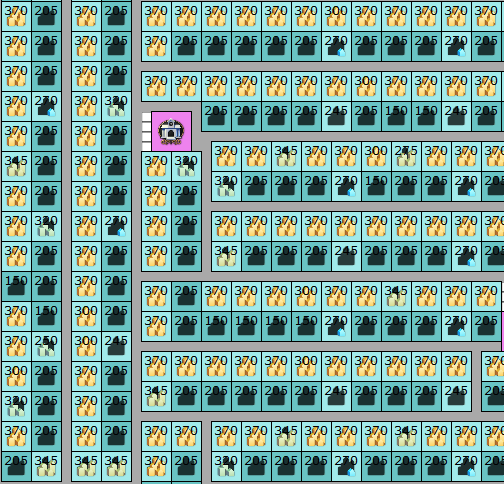
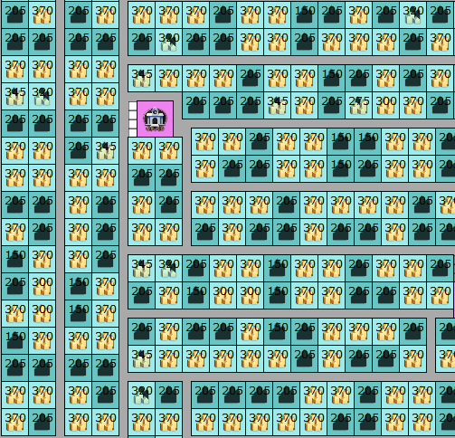
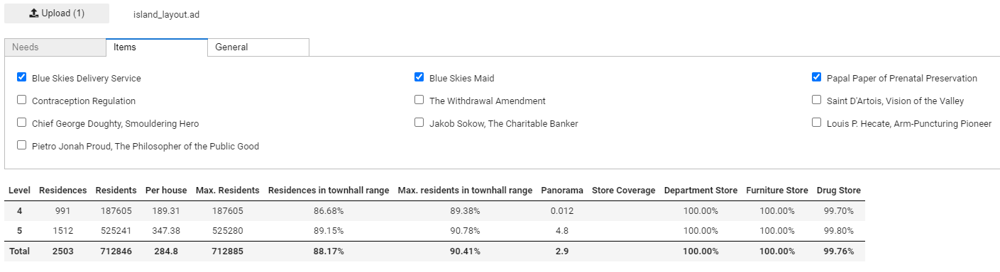
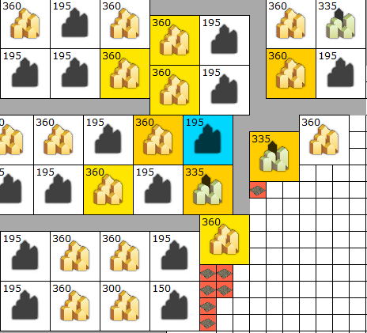
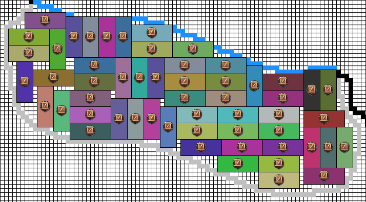
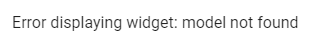
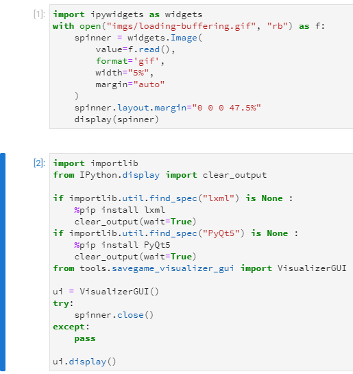
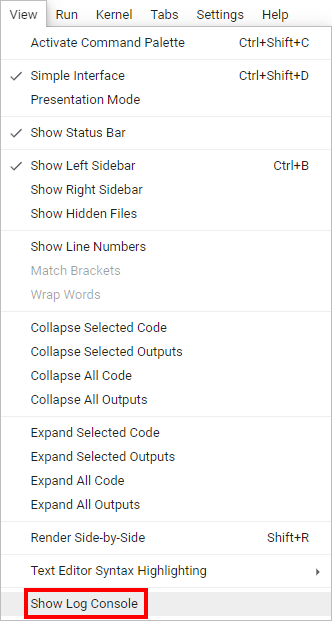

# Anno 1800 Optimization Tools
Push Anno 1800 to its limits by finding the best possible solution to a problem - applies to skyscraper residents, depots, and docklands trade.

## Skyscraper Levels
Maximizes the total number of residents by finding the best arrangement of Level 4 and Level 5 skyscrapers to maximize the panorama effect.

 

(Left: manually adjusted skyscraper levels; right: optimized levels by the tool)

### Getting Started
1. Export the island as an Anno Designer Layout: https://github.com/NiHoel/Anno1800SavegameVisualizer
   * It is recommended to enable `Residents` and `Equipped Items` under the `Labels` tab before exporting
2. Download the latest release of this repository: https://github.com/nihoel/Anno1800OptimizationTools/releases/latest
3. Extract the archive.
4. Double click on skyscraper_level.ipynb (must open in Jupyter Lab).
5. The two images at the top of the software show which buttons you need to click to run the software.

### Advanced
* The needs tab specifies all goods you supply. Fulfilment by items is handled by selecting the corresponding item.
* Increase the time limit to gain better results (however, experience on large islands shows that improvements after one hour are marginal, and after 6 hours, no improvement occurs)
* There are two ways to specify the equipped items:
    * Identical items in all townhalls: Use the checkboxes in the `Items` tab
    * Different items in townhalls: 
        1. Equip the items in the game
        2. Export the island with selected `Equipped Items` under the `Labels` tab (savegame visualizer)
        3. Select `Use item list stored in townhall label` under the `General` tab (skyscraper levels)
* `Enforce full supply`: Use this option to prevent skyscrapers from becoming level 5 skyscrapers if the drug store need is not fulfilled.
* If you want to optimize for level 3 engineers and investors, at least 20% of the residences in the layout must be engineer residences (or skyscrapers). The optimizer then chooses a different mode where it first improves the distribution of level 3 skyscrapers and then places some level 5 investor skyscrapers. After loading the file, the status bar shows which mode is picked.
* If the island consists of multiple disconnected residence areas (e.g. islands on Crown Falls), the tool does one run per area (with a lower time limit). Cutting the problem into smaller pieces yields better results than doing one big run. One can add more cuts to make it more manageable (and obtain better results): Use the Anno Designer to mark a corridor that splits the island into two parts. To mark a residence as part of the corridor, label it with '-' (hint: you need to delete the existing building and place a new one with the label '-'). It is recommended that the corridor is approximately 6 residences broad.

### Comparison
You have built an island in Anno in accordance to a reference file and you want to check that levels and panorama effects are correct?
1. Use the Savegame visualizer to export the island. Check `Residents` under the `Labels` tab.
2. Load both files in `comparison.ipynb` and click `Save Diff`
3. Yellow residences have fewer residents than the reference file proposes, blue ones more. Note: Residences can have panorama effects that are higher or lower than they should be. Downgrade and upgrade the building to correct it.

## Depots
Place as many depots as possible in the harbour area

## Arbitrage
Calculate how many residents you can supply by exploiting docklands

* Requires basic coding skills to add and remove comments

## Troubleshooting
#### The obtained population is much larger/smaller than expected
Check that the correct items are equipped and power plants have the correct range (Anno Designer: View -> Show True Influence Range) 

#### Error displaying widget

That is normal when you open the software. Run the software as usual and the user interface will appear.

#### Code expanded

If you have opened one of the two blocks depicted above: Click on the blue bar on the left to collapse it. Make sure you didn't change anything there by accident. If strange things happen afterwards, re-download the software

#### Error in the status bar
Contact me if you fail to understand or resolve the error displayed there. To help me solve the issue, open the log console and copy its content.

## Contact and Feedback
* Join the Annoverse discord: https://discord.gg/V4xhZ8Z
* Ask questions or give feedback in the #user-tools channel or write me a message (user: DuxVitae#7882)
* I welcome any kind of feedback: Bugs, user experience improvements, feature suggestions.
* If you are student or staff of an academic institution, you get free access to commercial solvers. If you want to solve problems faster (and get better results) contact me. 

## Disclaimer
The software is provided without warranty of any kind. The work was NOT endorsed by Ubisoft Blue Byte in any kind. All the assets from Anno 1800 game are © by Ubisoft.

## License
* [MIT](https://github.com/AnnoDesigner/anno-designer/blob/master/LICENSE) for the Python (*.py) and Jupyter Notebook (*.ipynb) files
* [ZIB ACADEMIC LICENSE](https://scipopt.org/academic.txt) for the [SCIP Optimization Suite](https://scipopt.org/index.php) (compiled binaries in tools). The license enforces certain conditions for redistribution. Source code: https://scipopt.org/download.php?fname=scipoptsuite-8.0.1.tgz
